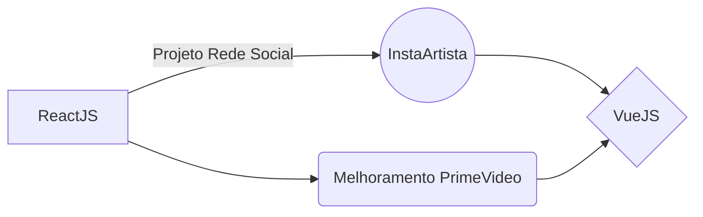

## Conteúdos Estudados

Aprendendo a triha front-end com os conteúdos básicos de:

|                |ReactJS                          |VueJS                         |
|----------------|-------------------------------|-----------------------------|
|Principais diferenças|`'Código mais denso'`            |'Código resumido'            |
|Desafios Pessoais          |`Rede social - artistas`            |Melhoramentos no Prime Video            |
|Dificuldades          |--- Resumir linhas de código |--- Adaptar projetos antigos|

> Seguir tutoriais de React da semana Spring React **DevSuperior** disponíveis no [neste link](https://devsuperior.com.br/evento-sds?episodio=1).

## Esquemas Práticos

Diagrama:

